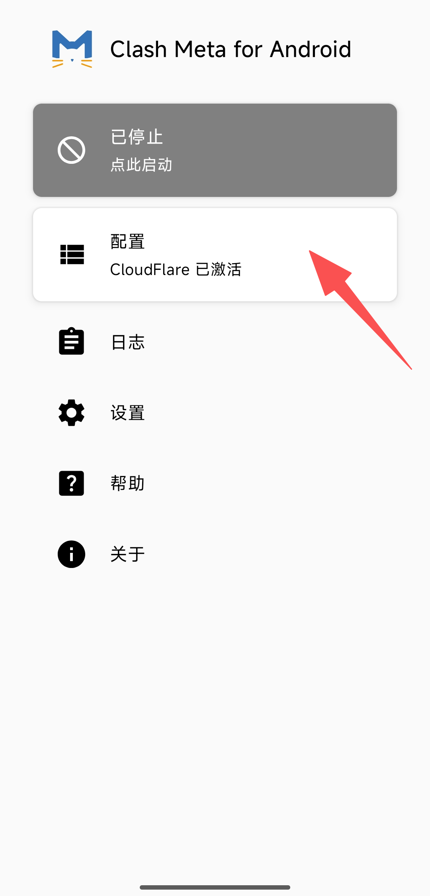
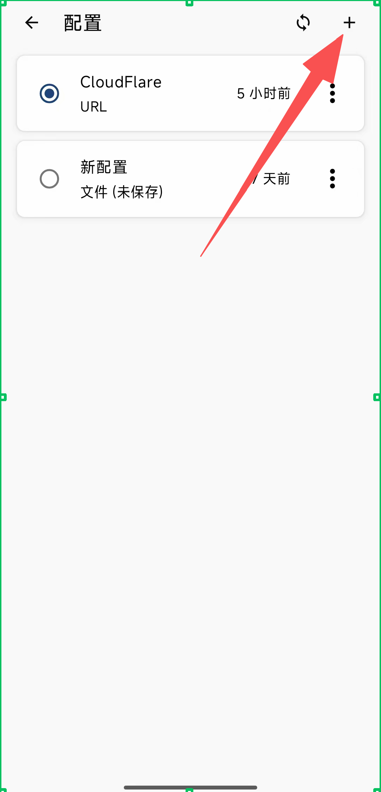
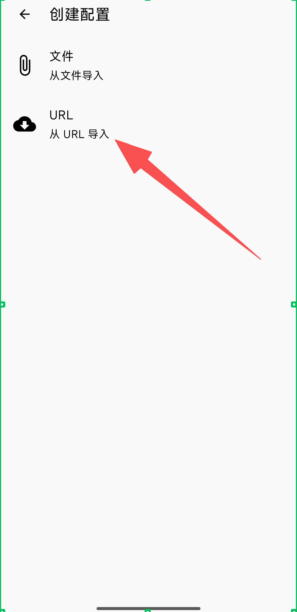
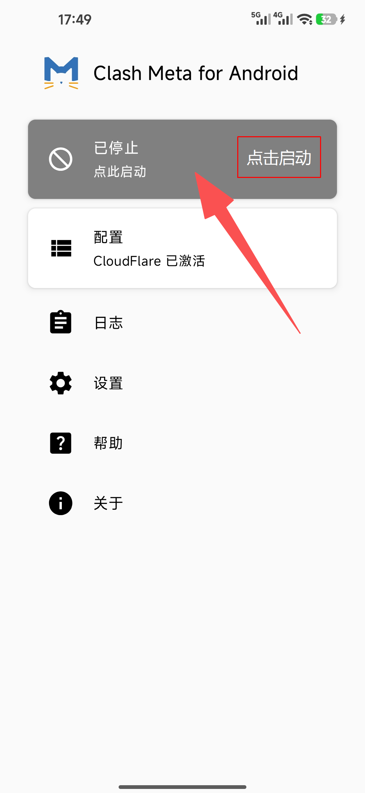

# Clash Meta for Android

> **Android 规则分流主力客户端** | 功能完整、策略组灵活、兼容性高

[Clash Meta for Android](https://github.com/MetaCubeX/ClashMetaForAndroid) 基于 Clash Meta 内核，适合对规则分流、策略组、节点管理有较高要求的用户，也是自由港机场在 Android 上的首选推荐。

## 协议支持

| 协议 | 支持状态 | 说明 |
|------|----------|------|
| VMess / VLESS | 支持 | 常用主流协议 |
| Trojan | 支持 | TLS 伪装常见方案 |
| Shadowsocks | 支持 | 兼容老方案 |
| Hysteria / WireGuard | 支持 | 视订阅而定 |

## 系统要求

- 最低版本：Android 8.0 及以上
- 推荐版本：Android 10 及以上
- 存储空间：200MB 可用空间

## 下载与安装

- Android universal（直链）：[下载 APK](https://github.com/MetaCubeX/ClashMetaForAndroid/releases/download/v2.11.24/cmfa-2.11.24-meta-universal-release.apk)
- Android universal（镜像加速）：[下载 APK](https://gh.xxooo.cf/https://github.com/MetaCubeX/ClashMetaForAndroid/releases/download/v2.11.24/cmfa-2.11.24-meta-universal-release.apk)
- 当前参考版本：`v2.11.24`

安装步骤：下载 universal 包后安装 APK，首次启动时允许 VPN 权限即可。

## 配置教程

### 步骤一：复制订阅链接

登录[自由港机场会员中心](https://freedomport.cc/#/dashboard)，在「我的订阅」的订阅链接区域，点击右侧的**复制**按钮，复制你的专属订阅链接。

### 步骤二：进入配置管理

打开 Clash Meta for Android，此时顶部显示「已停止」。点击下方的**配置**卡片，进入配置管理页面。

### 步骤三：新建配置

在配置列表页，点击右上角的**加号（+）**，开始新建一个配置。

### 步骤四：选择从 URL 导入

在「创建配置」页面，选择 **URL（从 URL 导入）**。

### 步骤五：填写配置信息并保存

在配置详情页依次完成四步：

1. **名称**：填写一个便于识别的名称，例如 `FREEDOMPORT`
2. **URL**：粘贴步骤一复制的订阅链接
3. **自动更新**：填入 `1440`（单位为分钟，即每 24 小时自动更新一次订阅）
4. 完成后点击右上角的**保存**图标

保存后应用会自动拉取节点配置，稍等片刻即可完成导入。

### 步骤六：启动连接

回到主界面，此时「配置」已显示为激活状态。点击顶部卡片右侧的**点击启动**按钮，首次连接时允许系统的 VPN 请求，即可开始使用。

启动成功后，打开浏览器访问外网验证是否连接正常。

## 日常使用

- **更新节点**：看到节点上新公告后，进入配置列表，点击对应配置右侧的菜单选择「更新」，或依赖已设置的自动更新
- **切换节点**：在主界面进入「代理」页面，选择延迟更低的节点或策略组
- **结束使用**：点击顶部卡片停止运行即可恢复直连

## 进阶功能

- **规则分流**：支持域名、IP、GeoIP 规则，可按直连 / 代理 / 拒绝分流，国内应用直连、国外走代理
- **策略组**：支持自动选择、手动选择、负载均衡，节点异常时可快速切换
- **状态监控**：实时流量统计、规则命中与连接日志查看

## 常见问题

**Q: 导入订阅后没有节点？**
A: 先手动更新配置；确认订阅链接可访问；确认套餐在有效期内、流量未用完。

**Q: 已连接但无法访问网站？**
A: 切换节点重试；检查是否已授予 VPN 权限；确认代理模式为规则或全局。

**Q: 节点延迟都很高？**
A: 先更换网络环境（如切换 Wi-Fi / 蜂窝网络），再切换到距离更近的节点组。

更多问题见[常见问题 FAQ](../../guide/faq.md)，或通过[联系支持](../../support.md)获取帮助。

---

> 最后更新：2026 年 3 月 28 日 · 适用版本 Clash Meta for Android v2.11.24
