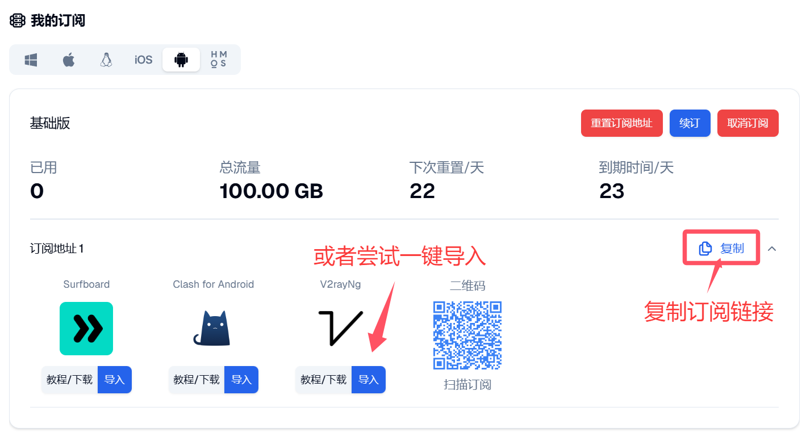

# v2rayNG for Android

> **Android 轻量客户端** | 导入订阅快、连接直观、兼容性高。Android 首选推荐见 [Clash Meta](clash-meta.md)。

[v2rayNG](https://github.com/2dust/v2rayNG) 是 Android 平台常用的代理客户端，适合希望快速完成订阅导入并直接连接节点的用户。

## 支持协议

| 协议 | 状态 | 说明 |
|------|------|------|
| VMess | 支持 | 常见 V2Ray 协议 |
| VLESS | 支持 | 新版主流协议 |
| Trojan | 支持 | 伪装流量方案 |
| Shadowsocks | 支持 | 兼容旧节点 |
| SOCKS | 支持 | 通用代理支持 |

## 系统要求

- 操作系统：Android 8.0 及以上
- 权限需求：网络权限、VPN 权限
- 存储空间：100MB 可用空间

## 下载与安装

- Android universal（直链）：[下载 APK](https://github.com/2dust/v2rayNG/releases/download/2.0.15/v2rayNG_2.0.15_universal.apk)
- Android universal（镜像加速）：[下载 APK](https://gh.xxooo.cf/https://github.com/2dust/v2rayNG/releases/download/2.0.15/v2rayNG_2.0.15_universal.apk)
- 当前参考版本：`2.0.15`

安装步骤：下载 universal.apk 后安装，启动应用并允许 VPN 权限。

## 导入订阅

登录[自由港机场会员中心](https://freedomport.cc/#/dashboard)，在「我的订阅」的订阅链接区域，有两种方式导入到 v2rayNG：

### 方式一：一键导入（推荐）

在手机浏览器打开会员中心，点击 **V2rayNg** 图标下方的**导入**按钮，系统会自动唤起 v2rayNG 并添加订阅，无需手动复制粘贴。

### 方式二：手动导入

1. 点击订阅链接右侧的**复制**按钮，复制订阅链接
2. 打开 v2rayNG，点击右上角的**加号（+）**
3. 选择**从剪贴板导入**（Import config from Clipboard）
4. 导入成功后，点击右上角的**更新**图标拉取节点

## 连接节点

1. 在订阅组中长按并选择**更新订阅**，确保节点列表为最新
2. 点选一个延迟较低的节点
3. 点击右下角的连接按钮，首次连接时允许系统的 VPN 请求
4. 打开浏览器访问外网，验证是否连接正常

## 进阶说明

- **路由设置**：可按需设置全局代理或分流模式，也可配置绕过局域网地址
- **流量统计**：实时查看上行 / 下行速度，观察连接稳定性和节点表现

## 常见问题

**Q: 导入报错或订阅为空？**
A: 链接可能失效或不完整；先在浏览器测试链接是否有返回，再重新导入。

**Q: 连上后打不开网页？**
A: 切换节点重试，检查 VPN 权限是否仍在，确认本地时间准确。

**Q: 节点全部超时？**
A: 先切换网络（Wi-Fi / 蜂窝），再更新订阅；如仍异常，见[常见问题 FAQ](../../guide/faq.md)。

## 相关链接

- 项目主页：https://github.com/2dust/v2rayNG
- 问题反馈：https://github.com/2dust/v2rayNG/issues

---

> 最后更新：2026 年 3 月 28 日 · 适用版本 v2rayNG 2.0.15
