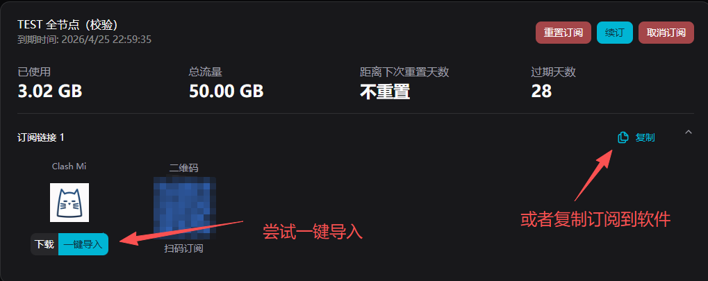
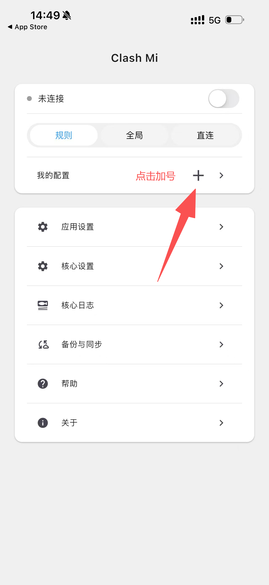
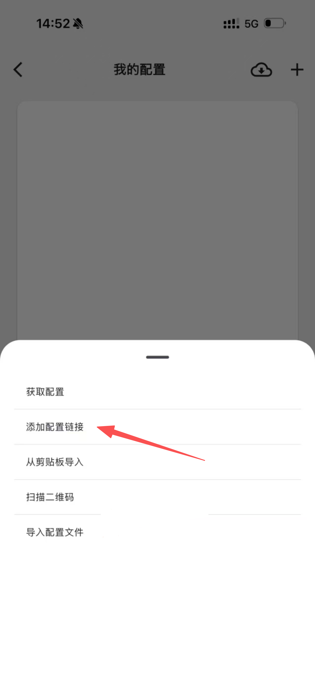
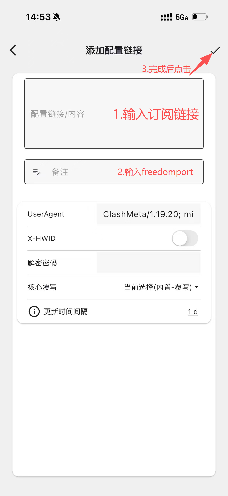
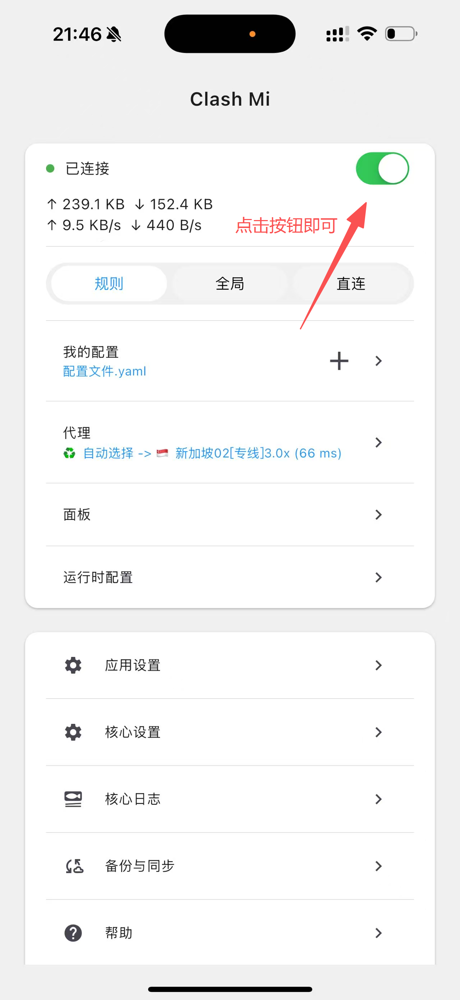

# Clash Mi for iOS / iPadOS

> **iOS / iPadOS 首选推荐 · 免费** | 订阅导入简单，日常使用稳定

Clash Mi 适合自由港机场用户在 iPhone / iPad 上快速完成订阅导入和节点切换，操作路径清晰，适合新手和日常使用。

## 系统要求

- iOS / iPadOS 15 及以上（建议使用最新系统）
- 可正常访问 App Store
- 设备可创建 VPN 配置

## 下载与安装

- App Store 直达链接：[前往下载](https://apps.apple.com/app/id6744321968)
- 使用外区 Apple ID 在 App Store 搜索并安装 `Clash Mi`
- 建议安装后先升级到最新版本再导入订阅

::: info
此类应用在国区 App Store 未上架，需要美区等外区 Apple ID 下载。登录外区 ID 下载后可切回常用账号，应用保留可用。
:::

## 配置教程

### 步骤一：复制订阅链接

登录[自由港机场会员中心](https://freedomport.cc/#/dashboard)，在「我的订阅」的订阅链接区域，点击右侧的**复制**按钮复制订阅链接；也可以直接点击 **Clash Mi** 下方的**一键导入**尝试自动唤起应用。

### 步骤二：新建配置

打开 Clash Mi，在主界面的「我的配置」一栏，点击右侧的**加号（+）**。

### 步骤三：选择添加配置链接

在底部弹出的菜单中，选择**添加配置链接**。

### 步骤四：填写配置并保存

在「添加配置链接」页面：

1. 在**配置链接 / 内容**框中粘贴步骤一复制的订阅链接
2. 在**备注**框填写一个名称，例如 `freedomport`
3. 完成后点击右上角的**对勾（√）**保存

保存后应用会自动拉取节点配置，稍等片刻即可完成导入。

### 步骤五：连接节点

回到主界面，点击右上角的**连接开关**，首次连接时允许系统的 VPN 请求，开关变绿即表示已连接。

- 保持默认的**规则**模式即可自动分流
- 点击**代理**一栏可以查看当前节点、手动切换到延迟更低的节点

连接成功后，打开浏览器访问外网验证是否正常。

## 推荐设置

- **连接模式**：默认使用规则模式（Rule），不建议长期全局代理，除非有明确需求
- **订阅更新**：购买新套餐或续费后，进入配置列表手动更新一次；也可依赖添加配置时设置的自动更新间隔

## 常见问题

**Q: 提示订阅无效？**
A: 检查链接是否完整；用浏览器打开链接测试是否有返回内容。

**Q: 显示已连接但无法上网？**
A: 切换节点测试；关闭再重新开启连接开关；检查系统时间与时区是否准确。

**Q: 节点全部不可用？**
A: 更新订阅后重测；确认套餐在有效期内、流量未用完。

更多问题见[常见问题 FAQ](../../guide/faq.md)，或通过[联系支持](../../support.md)获取帮助。

---

> 最后更新：2026 年 3 月 28 日 · 适用平台 iOS / iPadOS
