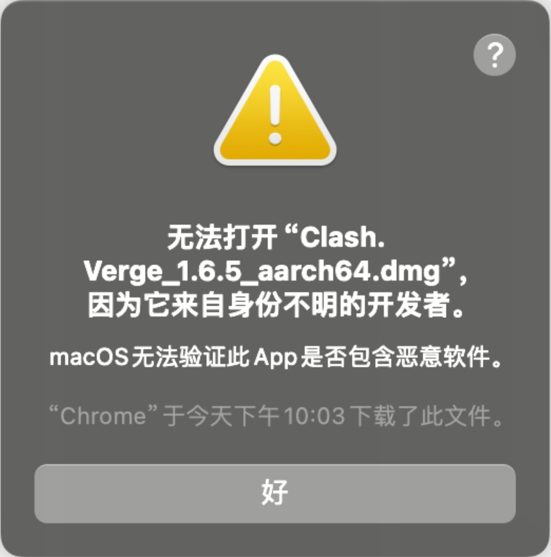
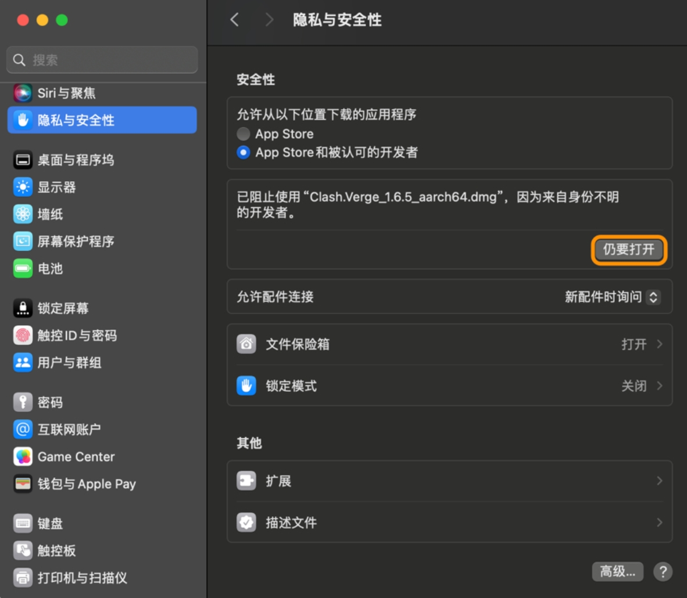
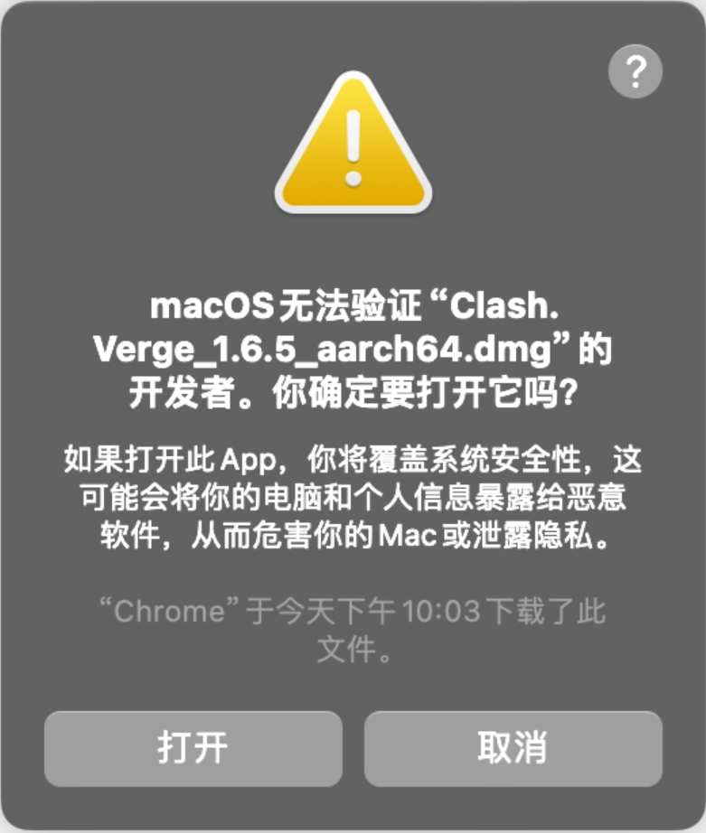
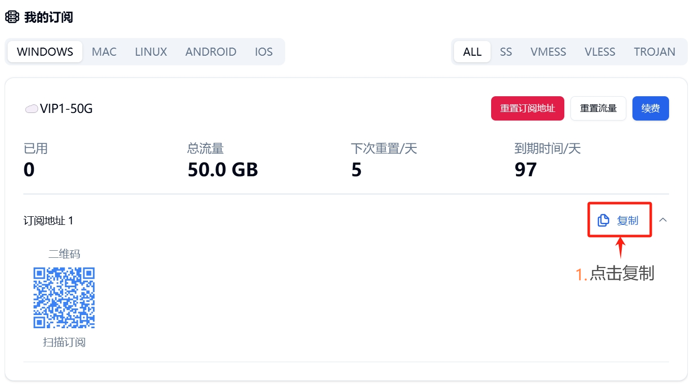
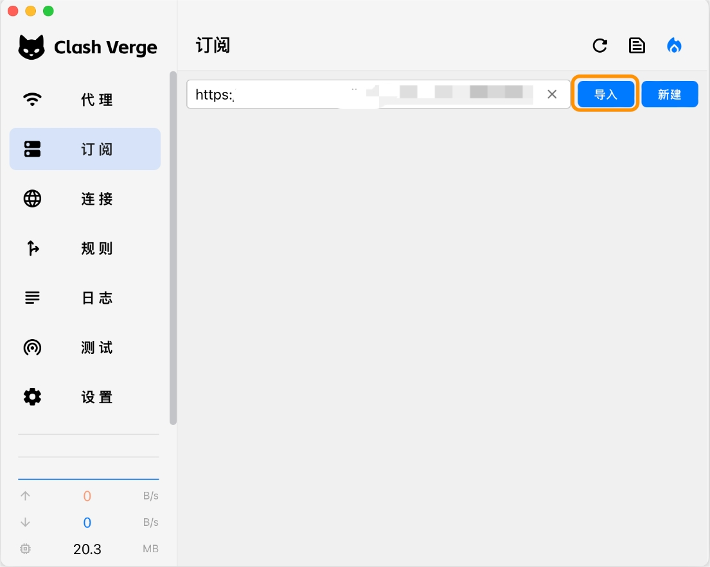
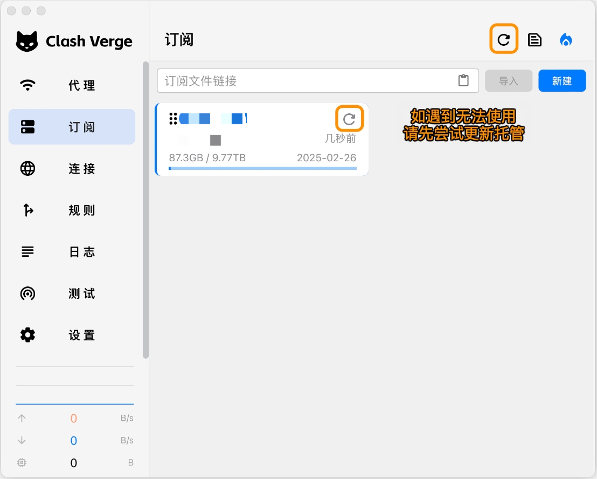
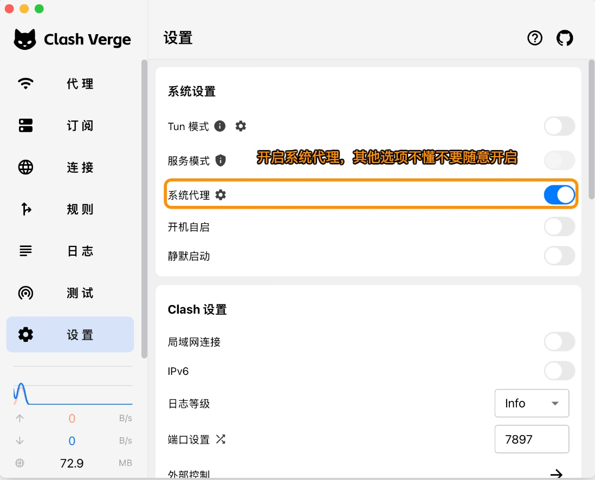
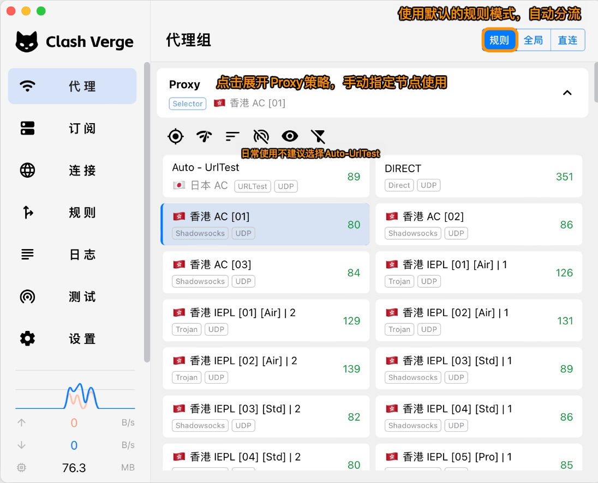

# Clash Verge Rev for macOS

> **macOS 推荐客户端** | 图形化清晰，规则分流完善，适合长期使用

[Clash Verge Rev](https://github.com/clash-verge-rev/clash-verge-rev) 为 macOS 提供现代化代理体验，支持 Apple Silicon 与 Intel 双架构，与 Windows 版配置习惯一致。

## 系统要求

* 最低版本：macOS 11 及以上
* 推荐版本：macOS 13 及以上
* 处理器：Intel x64 / Apple Silicon
* 内存：4GB（推荐 8GB 及以上）

## 下载与安装

* Apple Silicon（直链）：[下载 dmg](https://github.com/clash-verge-rev/clash-verge-rev/releases/download/v2.4.7/Clash.Verge_2.4.7_aarch64.dmg)
* Intel x64（直链）：[下载 dmg](https://github.com/clash-verge-rev/clash-verge-rev/releases/download/v2.4.7/Clash.Verge_2.4.7_x64.dmg)
* 镜像加速：在上述直链前加前缀 `https://gh.xxooo.cf/`
* 当前参考版本：`v2.4.7`

架构选择：Apple Silicon（M 系列）选 `aarch64` 包，Intel Mac 选 `x64` 包。

## macOS 安全设置

首次运行可能提示「无法验证开发者」，按以下三步允许运行：

**1. 出现安全提示**：首次打开时提示无法验证开发者，先点「好」关闭。

**2. 在系统设置中允许**：打开「系统设置 -> 隐私与安全性」，在安全性区域找到被阻止的提示，点击**仍要打开**。

**3. 确认打开**：在弹出的确认窗口点击**打开**，应用即可正常启动。

## 配置教程

### 步骤一：复制订阅链接

登录[自由港机场会员中心](https://freedomport.cc/#/dashboard)，在「我的订阅」的订阅链接区域，点击右侧的**复制**按钮复制订阅链接。

### 步骤二：导入订阅

打开 Clash Verge，点击左侧的**订阅**，将复制的链接粘贴到顶部的订阅文件链接框，点击**导入**。

### 步骤三：更新订阅

导入成功后会出现订阅卡片。如果之后遇到无法使用的情况，先点击右上角的**刷新**图标或订阅卡片上的刷新按钮，更新托管获取最新节点。

### 步骤四：开启系统代理

进入左侧的**设置**页，打开**系统代理**开关即可开始代理上网。其他选项如不了解，不要随意开启。

### 步骤五：选择模式与节点

进入左侧的**代理**页：

* 使用默认的**规则**模式即可自动分流（国内直连、国外走代理）
* 点击展开 **Proxy** 策略组，手动指定要使用的节点
* 日常使用不建议选择 Auto-UrlTest，手动选一个延迟较低的节点更稳定

选择完成后，打开浏览器访问外网验证是否连接正常。

## 主要功能

* **流量监控**：实时查看上行 / 下行速率与连接、规则命中情况
* **策略组**：支持自动选择、手动切换、负载均衡，网络波动时可快速切换
* **跨设备一致**：与 Windows 版配置习惯一致，便于多设备使用

## 常见问题

**Q: 导入后节点为空？** A: 先手动更新订阅（步骤三）；确认订阅链接可访问；确认套餐有效、流量未用完。

**Q: 已连接但不能访问？** A: 检查系统代理开关是否已开；切换节点；确认本机时间正确。

**Q: 启动被系统拦截？** A: 按上方「macOS 安全设置」在隐私与安全性中允许应用，再重新打开。

更多问题见[常见问题 FAQ](../../guide/faq.md)。

***

> 最后更新：2026 年 3 月 28 日 · 适用版本 Clash Verge Rev v2.4.7
