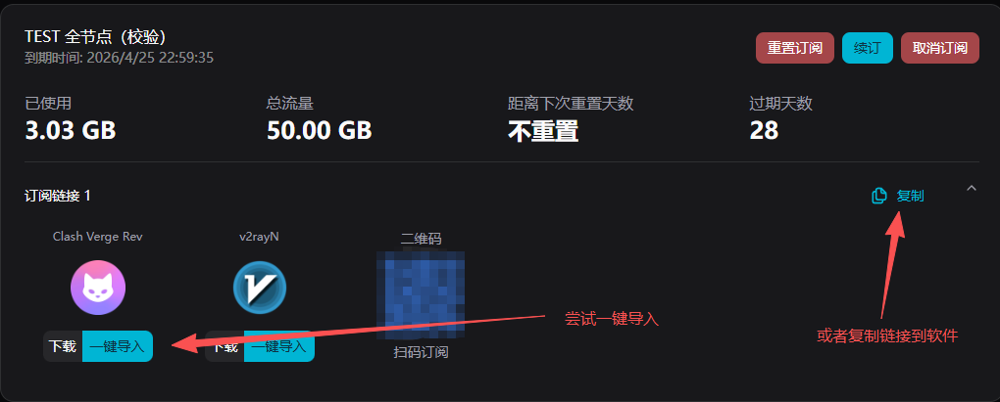
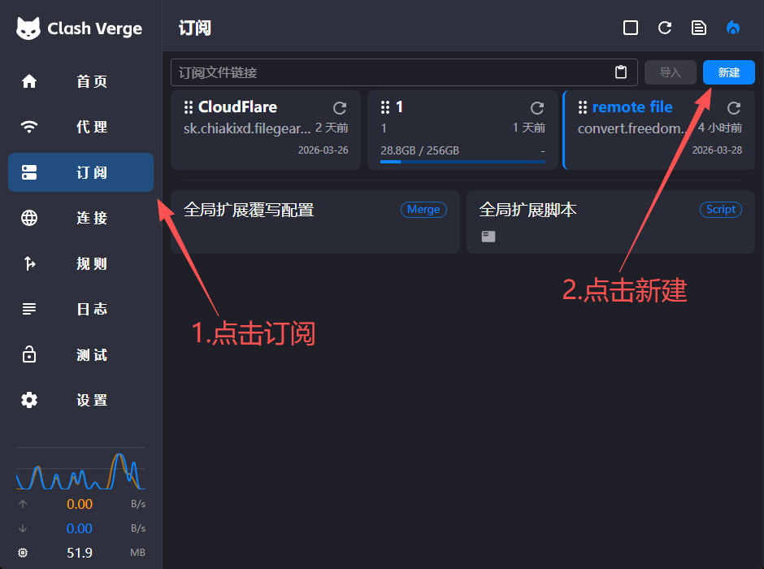
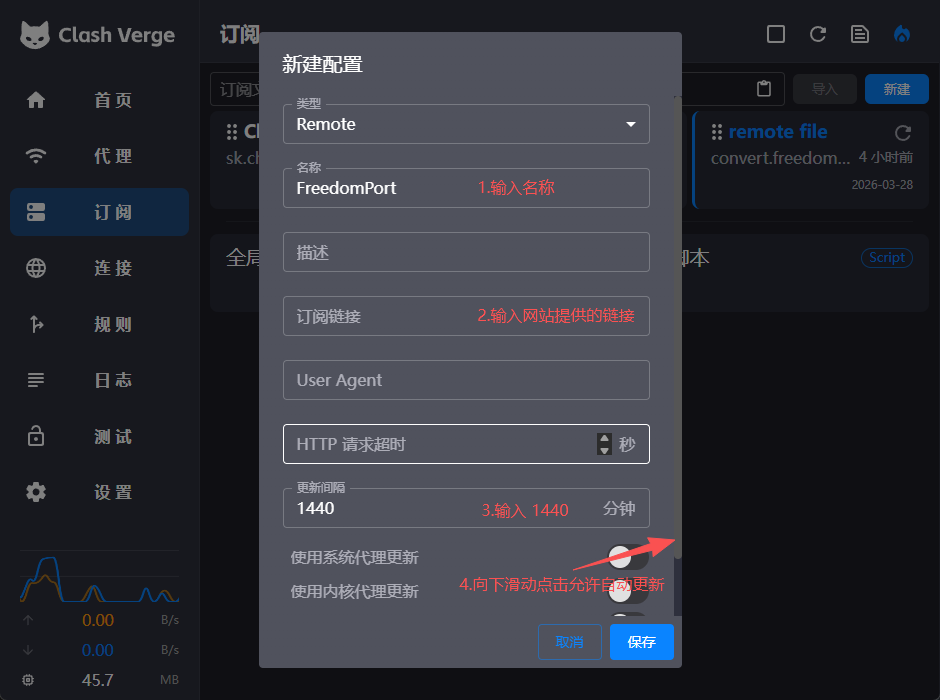
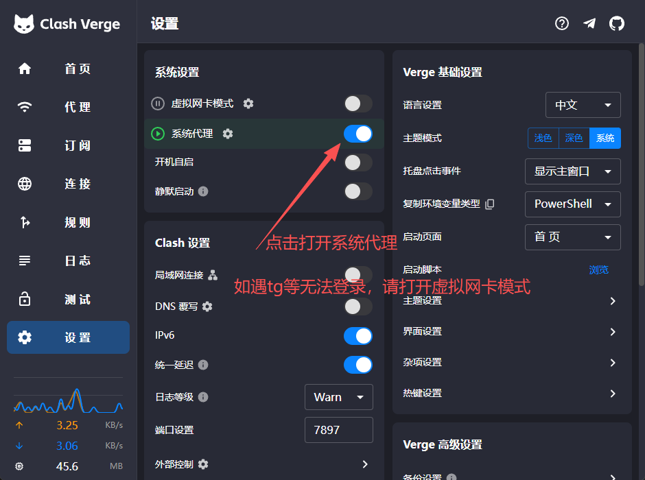
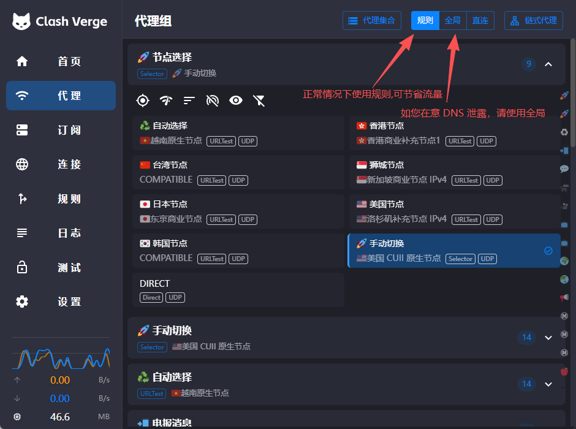

# Clash Verge Rev for Windows

> **现代化 GUI 客户端** | 规则分流清晰、策略组管理强、上手直观

[Clash Verge Rev](https://github.com/clash-verge-rev/clash-verge-rev) 是基于 Clash 内核的图形客户端，适合需要规则分流、策略组切换和可视化操作的用户，也是自由港机场在 Windows 上的首选推荐。

## 平台支持

| 平台 | 状态 | 说明 |
|------|------|------|
| Windows | 完全支持 | 本文档适用平台 |
| macOS | 完全支持 | 另有 [macOS 教程](../macos/clash-verge.md) |
| Linux | 完全支持 | 桌面发行版可用，见 [Linux 教程](../others/linux.md) |

## 系统要求

| 项目 | 最低要求 | 推荐配置 |
|------|----------|----------|
| **操作系统** | Windows 10 | Windows 11 |
| **架构** | x64 | x64 |
| **内存** | 4GB | 8GB 及以上 |
| **存储空间** | 300MB | 1GB 及以上 |

## 下载与安装

- Windows x64（直链）：[下载安装包](https://github.com/clash-verge-rev/clash-verge-rev/releases/download/v2.4.7/Clash.Verge_2.4.7_x64-setup.exe)
- Windows ARM64（直链）：[下载安装包](https://github.com/clash-verge-rev/clash-verge-rev/releases/download/v2.4.7/Clash.Verge_2.4.7_arm64-setup.exe)
- Windows x64（镜像加速）：[下载安装包](https://gh.xxooo.cf/https://github.com/clash-verge-rev/clash-verge-rev/releases/download/v2.4.7/Clash.Verge_2.4.7_x64-setup.exe)
- 当前参考版本：`v2.4.7`

安装说明：下载 `x64-setup.exe` 后正常安装并首次启动；如遇系统安全提示，选择继续运行。

## 配置教程

### 步骤一：复制订阅链接

登录[自由港机场会员中心](https://freedomport.cc/#/dashboard)，在「我的订阅」的订阅链接区域，点击右侧的**复制**按钮复制订阅链接；也可以直接点击 **Clash Verge Rev** 下方的**一键导入**尝试自动唤起软件。

### 步骤二：新建订阅

打开 Clash Verge，点击左侧的**订阅**，再点击右上角的**新建**。

### 步骤三：填写配置信息

在弹出的「新建配置」窗口中：

1. **类型**：保持 `Remote`
2. **名称**：填写便于识别的名称，例如 `FreedomPort`
3. **订阅链接**：粘贴步骤一复制的订阅链接
4. **更新间隔**：填入 `1440`（分钟，即每 24 小时自动更新一次）
5. 向下滑动并开启**允许自动更新**，最后点击**保存**

### 步骤四：开启系统代理

进入左侧的**设置**页，打开**系统代理**开关即可开始代理上网。

如果遇到 Telegram 等应用无法登录，请同时打开**虚拟网卡模式（TUN）**。

### 步骤五：选择模式与节点

进入左侧的**代理**页：

- 正常情况使用**规则**模式，国内直连、国外走代理，可节省流量
- 如果在意 DNS 泄露，切换到**全局**模式
- 在节点列表中选择一个延迟较低的节点或策略组

选择完成后，打开浏览器访问外网验证是否连接正常。

## 主要功能

- **策略分流**：支持规则、全局、直连模式，支持策略组自动 / 手动切换
- **状态与日志**：可查看连接情况与规则命中，快速定位连接失败原因
- **可视化管理**：图形界面直观操作配置，适合非命令行用户日常维护

## 常见问题

**Q: 导入成功但没有节点？**
A: 先在订阅页手动更新配置；若仍为空，检查订阅链接是否可访问，确认账号套餐有效、流量未用完。

**Q: 节点都超时？**
A: 切换网络重试；更换低延迟节点；确认本地防火墙未拦截应用。

**Q: 连接后无法打开网页？**
A: 检查模式是否为规则 / 全局，确认系统代理已启用后再测试。

**Q: 检测到 DNS 泄露？**
A: 切换到全局模式，或参考[代理后的隐私保护](../../guide/privacy.md)。

更多问题见[常见问题 FAQ](../../guide/faq.md)。

---

> 最后更新：2026 年 3 月 28 日 · 适用版本 Clash Verge Rev v2.4.7
