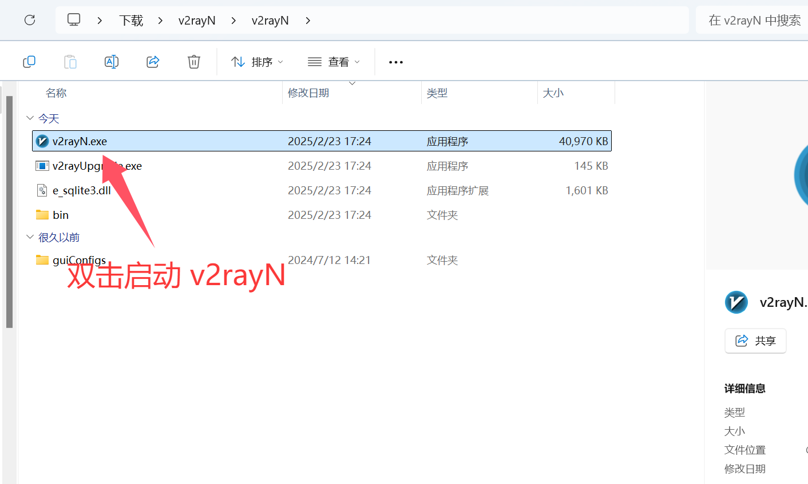
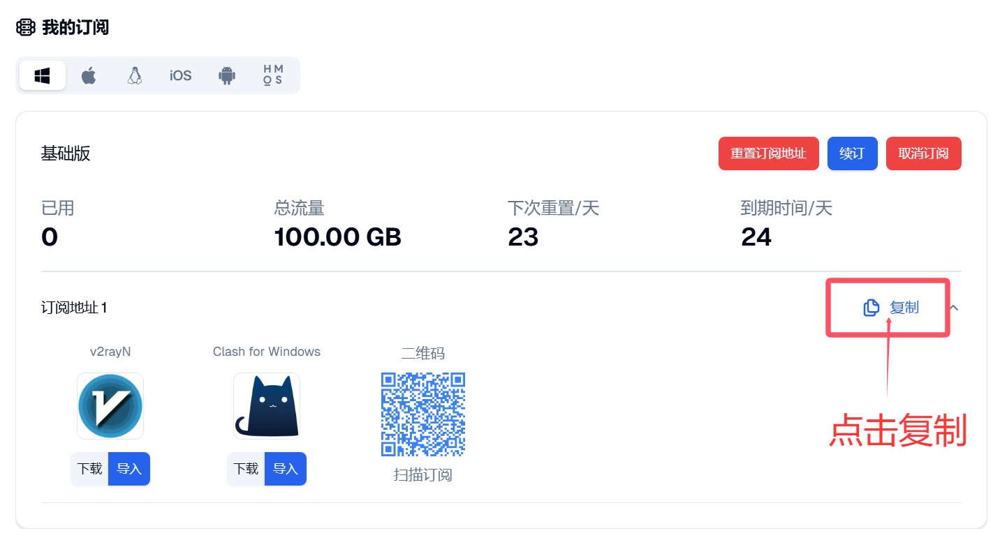

# v2rayN for Windows

> **Windows 轻量客户端** | 高兼容、支持主流协议。Windows 首选推荐见 [Clash Verge Rev](clash-verge.md)。

[v2rayN](https://github.com/2dust/v2rayN) 是 Windows 上非常成熟的代理客户端，支持 VMess、VLESS、Trojan、Shadowsocks 等协议，适合需要稳定订阅使用和快速排障的用户。

## 协议支持

| 协议类型 | 支持状态 |
|---------|---------|
| **Shadowsocks (SS)** | 完全支持 |
| **Trojan** | 完全支持 |
| **VMess** | 完全支持 |
| **VLESS** | 完全支持 |
| **SOCKS5** | 完全支持 |

## 系统要求

| 项目 | 最低要求 | 推荐配置 |
|------|----------|----------|
| **操作系统** | Windows 10/11 | Windows 11 |
| **处理器** | 双核 CPU | 四核及以上 |
| **内存** | 4GB | 8GB 及以上 |
| **存储空间** | 200MB | 1GB 及以上 |

## 下载与安装

- Windows x64（直链）：[下载 zip](https://github.com/2dust/v2rayN/releases/download/7.19.5/v2rayN-windows-64.zip)
- Windows ARM64（直链）：[下载 zip](https://github.com/2dust/v2rayN/releases/download/7.19.5/v2rayN-windows-arm64.zip)
- 镜像加速：在上述直链前加前缀 `https://gh.xxooo.cf/`
- 当前参考版本：`7.19.5`

安装说明：下载 zip 后解压到独立目录（建议 `D:\Apps\v2rayN`），无需安装。

## 配置教程

### 步骤一：启动客户端

解压后双击 **v2rayN.exe** 启动程序。首次运行如提示组件安装，按提示完成即可。

### 步骤二：复制订阅链接

登录[自由港机场会员中心](https://freedomport.cc/#/dashboard)，在「我的订阅」的订阅链接区域，点击右侧的**复制**按钮复制订阅链接。

### 步骤三：导入订阅

回到 v2rayN，点击顶部菜单的**服务器**，选择**从剪贴板导入分享链接（Ctrl+V）**，即可导入刚才复制的订阅。

### 步骤四：更新订阅

点击顶部菜单的**订阅分组**，选择**更新全部订阅（不通过代理）**，拉取最新节点。

### 步骤五：开启系统代理

在底部的**系统代理**下拉框中，选择**自动配置系统代理**即可开启代理。（选择「清除系统代理」即可关闭代理。）

### 步骤六：选择节点

在节点列表中**右键点击**目标节点，选择**设为活动服务器（Enter）**，即可切换到该节点。建议选择延迟较低的节点。

完成后打开浏览器访问外网，验证是否连接正常。

### 步骤七：结束使用

使用完毕后，在电脑右下角**右键点击** v2rayN 托盘图标，选择**退出**即可关闭软件并恢复直连。

## 核心功能

- **订阅管理**：多订阅并存，支持手动刷新快速同步新节点
- **代理模式**：系统代理（全局）、PAC 分流（规则）、手动代理（本地端口）
- **状态监控**：节点延迟测试、实时流量统计、连接与错误日志

## 常见问题

**Q: 订阅更新失败？**
A: 先在浏览器打开订阅链接确认可访问，再检查本地网络、系统时间，最后重新导入订阅。

**Q: 已连接但无法上网？**
A: 检查系统代理是否为「自动配置系统代理」；切换节点测试；确认安全软件未拦截 v2rayN。

**Q: 节点速度慢？**
A: 优先同地区低延迟节点；避免高峰期拥堵节点；定期更新订阅。

更多问题见[常见问题 FAQ](../../guide/faq.md)。

---

> 最后更新：2026 年 3 月 28 日 · 适用版本 v2rayN 7.19.5
